<div align="center">

# DualView AI

**AI-powered video comparison and creator intelligence platform.**

Compare YouTube and Instagram videos side-by-side — analyze engagement, hook strength, message clarity, tone, pacing, and creator improvement opportunities through a grounded RAG-powered chat interface.

[](https://fastapi.tiangolo.com)
[](https://reactjs.org)
[](https://typescriptlang.org)
[](https://python.org)
[](https://ai.google.dev)
[](https://www.trychroma.com)

</div>

---

## Overview

DualView AI lets users paste two video URLs — any combination of YouTube and Instagram — and receive a structured, AI-generated comparison. The platform extracts metadata, processes transcripts where available, and uses Retrieval-Augmented Generation to answer questions grounded in actual video content rather than hallucinated summaries.

The chat interface is not a general assistant. It is scoped to video analysis, creator coaching, debate-style arguments, and engagement breakdowns — with source citations backed by retrieved transcript chunks.

---

## Key Features

| Feature | Description |
|---|---|
| **Video Comparison** | YouTube vs YouTube, YouTube vs Instagram, and all combinations |
| **Metadata Extraction** | Title, views, likes, comments, duration, hashtags, engagement rate, thumbnail |
| **Transcript Intelligence** | Captions, auto-generated subtitles, Whisper fallback, multilingual support |
| **RAG Chatbot** | Answers grounded in retrieved transcript chunks with source citations |
| **AI Debate Mode** | Arguments for Video A, arguments for Video B, and a balanced verdict |
| **Creator Coaching** | Hook, pacing, message clarity, emotional storytelling, CTA suggestions |
| **Guardrails** | Refuses unrelated queries (politics, coding, math). Stays video-scoped. |
| **Streaming Chat** | Server-Sent Events for real-time token-by-token response streaming |

---

## System Architecture

<p align="center">
  
</p>`

> Session-based isolation: Video A and Video B chunks are stored and retrieved separately to prevent cross-contamination. Metadata-only mode engages automatically when transcripts are unavailable.

---

## Tech Stack

### Frontend


### Backend


| Layer | Technology |
|---|---|
| API Framework | FastAPI (Python) |
| Video / Metadata Extraction | yt-dlp |
| Audio Processing | FFmpeg |
| Fallback Transcription | Whisper / faster-whisper |
| LLM | Gemini 2.5 Flash |
| Embedding Model | Gemini Embedding |
| Vector Store | ChromaDB |
| Streaming | Server-Sent Events (SSE) |
| Frontend Animations | LottieFiles / lottie-react |
| Video Playback | ReactPlayer |
| Markdown Rendering | React Markdown + remark-gfm |

---

## Cost & Scalability Reasoning

DualView AI is built to be cost-efficient from the ground up.

- **Caption-first pipeline** — transcription via Whisper only triggers when captions are unavailable, avoiding unnecessary compute cost.
- **RAG over full-context injection** — ChromaDB retrieves only the most semantically relevant chunks per query, reducing token usage per response.
- **Metadata-first answers** — questions about duration, views, or upload date do not require transcript retrieval or LLM calls.
- **Session-scoped embeddings** — chunks are embedded once and reused across all subsequent queries in the session.

**For production scale, recommended improvements:**

- Persistent video-level cache keyed by video ID to avoid reprocessing on repeat submissions
- Queue-based ingestion workers for concurrent analysis requests
- Object storage (S3 or equivalent) for thumbnails and temporary audio
- Rate limiting on ingestion and chat endpoints
- Structured logging, monitoring, and managed ChromaDB deployment

---

## Instagram & Transcript Limitations

Instagram can restrict access to video media, captions, view counts, and playback depending on account privacy, login requirements, regional restrictions, and platform-level policies.

DualView AI attempts metadata extraction, thumbnail extraction, playable URL extraction, and transcription whenever content is publicly accessible. If Instagram blocks access at any stage, the app falls back gracefully to whatever data is retrievable and clearly communicates which fields or capabilities are unavailable for that video.

> Full transcript support cannot be guaranteed for Instagram content.

---

## Project Structure

```
Dualview-ai/
├── backend/
│   ├── app/
│   │   ├── main.py
│   │   ├── config.py
│   │   ├── models/
│   │   ├── routes/
│   │   └── services/
│   ├── requirements.txt
│   └── .env.example
├── frontend/
│   ├── src/
│   │   ├── pages/
│   │   ├── components/
│   │   ├── lib/
│   │   └── assets/
│   └── package.json
└── README.md
```

---

## Environment Variables

**Backend — `.env`**

```env
GOOGLE_API_KEY=your_google_api_key_here
LLM_MODEL=gemini-2.5-flash
EMBEDDING_MODEL=gemini-embedding-001
CHROMA_DIR=./data/chroma
FRONTEND_ORIGIN=http://localhost:5173
WHISPER_MODEL=base
```

**Frontend — `.env`**

```env
VITE_API_BASE_URL=http://127.0.0.1:8000
```

> Never commit real `.env` files. Use `.env.example` files with placeholder values.

---

## Installation

### Prerequisites

- Python 3.10+
- Node.js 18+ with `pnpm`
- FFmpeg installed and available in system PATH

Install FFmpeg from [ffmpeg.org](https://ffmpeg.org/download.html) and verify it is accessible via the `ffmpeg` command before starting the backend.

### Backend

```bash
cd backend
python -m venv .venv

# Windows
.venv\Scripts\activate

# macOS / Linux
source .venv/bin/activate

pip install -r requirements.txt
cp .env.example .env
# Fill in your API keys in .env
```

### Frontend

```bash
cd frontend
pnpm install
cp .env.example .env
```

---

## Running the Project

**Backend:**

```bash
cd backend
uvicorn app.main:app --reload --port 8000
```

**Frontend:**

```bash
cd frontend
pnpm dev
```

Frontend runs at `http://localhost:5173`. Backend API at `http://127.0.0.1:8000`.

---

## API Reference

### `POST /api/ingest`

Accepts two video URLs, extracts metadata and transcripts, indexes chunks into ChromaDB, and returns a session ID.

**Request:**

```json
{
  "video_a_url": "https://www.youtube.com/watch?v=...",
  "video_b_url": "https://www.instagram.com/reel/..."
}
```

**Response:**

```json
{
  "session_id": "abc-123",
  "video_a": { "title": "...", "views": 0, "duration": 0 },
  "video_b": { "title": "...", "views": 0, "duration": 0 },
  "chunks_indexed": { "video_a": 24, "video_b": 18 },
  "warnings": ["Instagram transcript unavailable. Continuing with metadata only."]
}
```

---

### `POST /api/chat/stream`

Streams an AI-generated answer via Server-Sent Events.

**Request:**

```json
{
  "session_id": "abc-123",
  "message": "Which video has a stronger hook?"
}
```

**Response:** `text/event-stream` — emits token events during streaming and a citation event at completion.

---

### `GET /api/sessions/{session_id}`

Returns stored metadata and session state for a given session.

---

## Demo Flow

1. Open the landing page and click **Get Started**
2. Paste two video URLs (YouTube and/or Instagram)
3. Click **Analyze** and wait for ingestion to complete
4. Review side-by-side metadata cards
5. Play videos inside the analysis page where supported
6. Open the chat section and try:
   - *Which video has better engagement?*
   - *Debate both videos — which one wins?*
   - *Give creator coaching for Video A*
   - *Summarize what is being said in Video B*
   - *Compare the hook strength of both videos*

---

## Future Improvements

- Persistent video-level cache to skip re-processing on repeated URLs
- Background ingestion queue with status polling
- TikTok and LinkedIn video support
- Exportable comparison report (PDF)
- User authentication and saved session history
- Analytics dashboard for query patterns and session volume

---

## Author

**Trideep Makal**

GitHub: [https://github.com/Trideep-2k26](https://github.com/Trideep-2k26)
